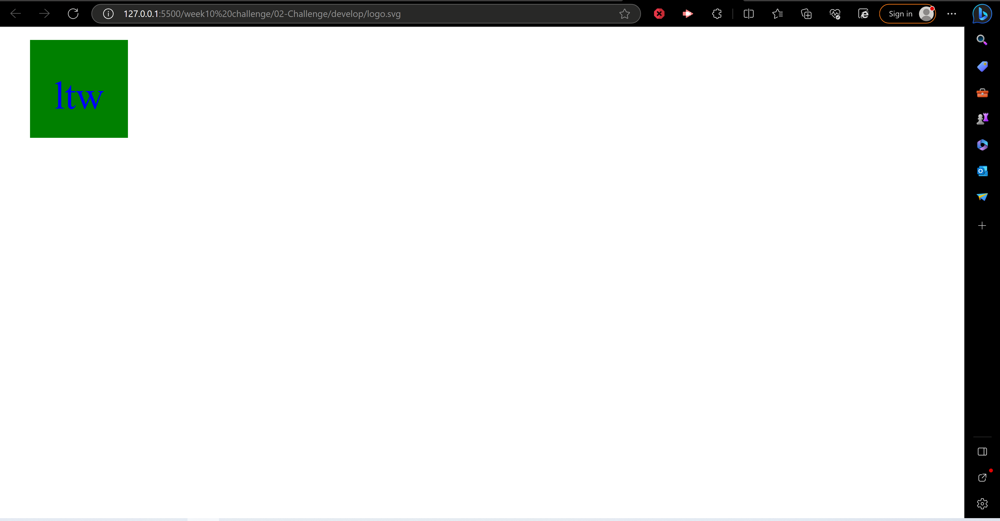

# Landen Logo Maker

## Title

Landen Logo Maker

# Table of Contents

- [GitHub](#github)
- [Description](#description)
- [Installation](#installation)
- [Usage](#usage)
- [License](#license)
- [How To Contribute](#howtocontribute)
- [Tests](#tests)
- [Screenshot](#screenshot)
- [Link](#link)

## GitHub

[Link](https://www.github.com/lwalker107)

## Email

landenwalker880@gmail.com

## Description

Asks the user a series of prompts to use the answers and create a personalized logo for their own use.

## Installlation 

npm i

## Usage

It is easy to use and requires you to have node.js installed on your computer.

## License

MIT

## How to Contribute

My GitHub username, a working understanding of Git and my email address to email me any questions.

## Tests

npm run tests

## Screenshot

## Link 

https://drive.google.com/file/d/1AOrYUjEL_56El1EO6CGbkxapQg06pjYo/view